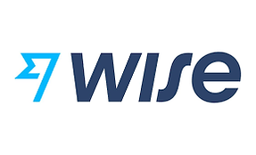

# [Wise](https://wise.com)

## Overview and Origin

 

 Wise (Former Transferwise), a foreign exchange financial technology company, was founded in 2011 by Kristo Käärmann and Taavet Hinrikus. The company's founders had the practice of transferring money internationally, until the moment, only using the banks in which they had accounts. Frustrated with expensive fees, both decided they could improve the flow of the financial foreign exchange with better exchange rates.
 
 With the initial funding of  $1.3 million from a consortium, including venture firms IA Ventures and Index Ventures, IJNR Ventures, NYPPE as well as individual investors such as PayPal co-founder Max Levchin, former Betfair CEO David Yu, and Wonga.com co-founder Errol Damelin. Wise also received investment after being named one of Seedcamp 2011's winners. 

 Wise is funded by 37 investors. Silicon Valley Bank UK and Silicon Valley Bank UK are the most recent investors.
 Afeter funding over 13 rounds, Wise has raised a total of $1.7B, their latest funding was raised on Oct 27, 2022 from a Post-IPO Debt round.
 

 
## Business Activities

 As described on the Wise website, Wise was launched in 2011 with the vision of making international money transfers cheap, fair, and simple. Today, Wise multi-currency account helps millions of people and businesses manage their money across the world. It's stands out from some of its competitors by not marking up exchange rates to fatten profits. The company boasts that it avoids “unfair” exchange rates charged by banks. 

Currently, Wise processes 4.5 billion pounds in cross-border transactions every month, has 10 million customers between people and businesses and was recently valued at 5 billion dollars. With the Wise account, the customers hold balances in over 50 currencies and use Wise debit card to shop and spend while abroad, saving them bank fees and time.

## Tecnology

Wise has about 120 engineers working in two dozen teams. The software is build in Grails and Groovy with suport in JAVA. It is build on the microservices architeture and utilises the Spring Boot and Spring Cloud liberies. The Spring Cloud adds integration for many useful tools in a service-oriented environment. Some are Spring projects, like the Config Server. Some leverage battle tested open source components like Netflix Eureka, Zuul and Hystrix.

For the persistence, was desire to meet the ACID criteria - Atomic, Consistent, Isolated and Durable. 
MySQL holds most of the data in production. Yet, migrating the analytical datastore to PostgreSQL is already underway as tests show it to be a better fit for the models and tooling.

Wise has about 120 engineers working in two dozen teams. The software is built in Grails and Groovy with support in JAVA. It is built on the microservices architecture and utilizes the Spring Boot and Spring Cloud libraries. The Spring Cloud adds integration for many useful tools in a service-oriented environment. Some are Spring projects, like the Config Server. Some leverage battle tested open source components like Netflix Eureka, Zuul and Hystrix.

On the persistence side, was a desire to meet the ACID criteria - Atomic, Consistent, Isolated and Durable. 
MySQL holds most of the data in production. Yet, migrating the analytical datastore to PostgreSQL is already underway as tests show it to be a better fit for the models and tooling.

To build the frontend, Wise uses Bower and NPM for dependency management. Grunt automates the builds. Jasmine and Protractor power the tests and Karma + PhantomJS run the tests. There’s also Webpack and Babel doing their part. Some parts of the code already use TypeScript. 

## Landscape

Remittance & money transfer software manages transfers of funds between companies as well as between companies and their customers. This type of software is used to securely transfer money in multiple currencies for various purposes, such as paying invoices or moving funds between different subsidiaries. Remittance & money transfer software is mainly used by finance professionals and by B2B customers to make payments online.

Like Wise, other companies operating in the Remittance & money transfer market as their competitors, some os them are:

* [MoneyGram](https://www.moneygram.com/): It offers a wide range of different options for sending, funding and collecting transfers, and has an extensive global network.
* [Xoom](https://www.xoom.com/): Owned by PayPal, Xoom is a money transfer service offering online transfers to bank accounts, mobile wallets and debit cards.
* [WorldRemit](https://www.worldremit.com/): Offers fast and secure online transfers all over the world, with a choice of flexible payment options
* [Ria Money Transfer](https://www.riamoneytransfer.com/): It offers a choice of methods to set up a payment, including online, from its own mobile app and in person from one of 490,000 worldwide locations.
* [XE](https://www.xe.com/): It offers competitive exchange rates and low fees, especially if you’re sending larger amounts.
* [Remitly](https://www.remitly.com/): As it doesn’t have any physical locations, Remitly works by delivering money through partners, such as banks and other money transfer services.
* [Skrill](https://www.skrill.com/): It offers an online wallet for sending money both locally and internationally, along with paying for goods and services online. You can manage your money 24/7 via the Skrill mobile app.
* [OFX](https://www.ofx.com/): You can make a single payment or set up recurring transfers, benefiting from locked-in exchange rates.

Traditionally, the costs of securely organising and transferring money globally have been relatively high. The rise in digitisation and automation reduced remittance cost and transfer time, and increased adoption of banking and financial services are driving the growth of the digital remittance market with the help of the internet. 
The remittance industry offers many opportunities for digital transformation and innovation. The rapid adoption of mobile phones, internet, and digital platforms has enabled new ways of sending and receiving money, such as mobile money, online platforms, e-wallets, and blockchain. These digital channels can reduce the cost, time, and friction of remittances, as well as increase the convenience, security, and transparency. They can also expand the reach and inclusion of remittance customers, especially in rural and remote areas where access to traditional financial services is limited or nonexistent.

## Results

* What has been the business impact of this company so far?

* What are some of the core metrics that companies in this domain use to measure success? How is your company performing, based on these metrics?

* How is your company performing relative to competitors in the same domain?

## Recommendations

* If you were to advise the company, what products or services would you suggest they offer? (This could be something that a competitor offers, or use your imagination!)

* Why do you think that offering this product or service would benefit the company?

* What technologies would this additional product or service utilise?

* Why are these technologies appropriate for your solution?

https://wise.com/
https://en.wikipedia.org/wiki/Wise_(company)
https://www.crunchbase.com/organization/transferwise
https://www.forbes.com/advisor/money-transfer/wise-review/
https://medium.com/wise-engineering/the-transferwise-stack-heartbeat-of-our-little-revolution-80e36482bcf9#:~:text=TransferWise%20started%20with%20MySQL.
https://www.linkedin.com/advice/1/what-key-trends-innovations-shaping-future-remittance